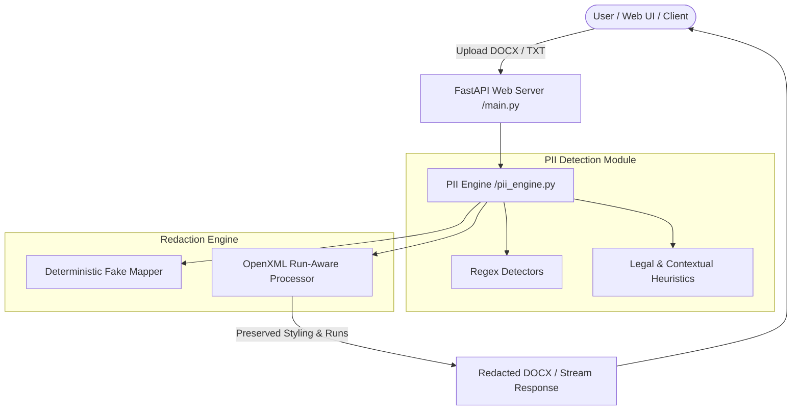

# ShieldDOCS - Format-Preserving PII Detection & DOCX Redaction Engine

[](https://www.python.org/)
[](https://fastapi.tiangolo.com/)
[](LICENSE)

**ShieldDOCS** is an enterprise-grade, format-preserving Personal Identifiable Information (PII) detection and redaction engine for Microsoft Word (`.docx`) documents and plain text files. 

Unlike standard redactors that wipe Word formatting (converting paragraphs into plain unstyled text), ShieldDOCS operates at the **Word OpenXML Run level (`<w:r>`)**, replacing sensitive text while preserving **100% of character styles** (bold, italic, font families, font sizes, colors, highlights, and complex table hierarchies).

---

## 📌 Context & Problem Statement

Redacting sensitive financial, legal, and personal data from Red Herring Prospectuses (RHPs), corporate contracts, and HR records often destroys document readability. Standard redaction tools:
1. Strip all rich formatting (bold headers, italicized notes, colored text highlights).
2. Destroy table layouts, borders, and column alignments.
3. Replace values with static black boxes or inconsistent placeholders, rendering documents unusable for secondary analysis.

**ShieldDOCS solves this** by combining:
- **Run-Aware XML Text Manipulation**: Replaces strings directly inside OpenXML run nodes (`<w:rPr>`), leaving parent and surrounding character styling untouched.
- **Deterministic Fake Generation**: Uses MD5 hash-seeded generators to ensure entity consistency (e.g., `Rahul Kapoor` is consistently mapped to `Kavya Reddy` across an entire document).
- **Multi-Layer PII Detection**: Combines regex detectors for structured PII with heuristic contextual detectors for unstructured legal and financial entities.

---

## ✨ Key Features

- 🎨 **Format-Preserving DOCX Redaction**: Retains bold, italic, underline, font color, font size, and table structure.
- 🔍 **Multi-Category PII Detection**:
  - **Structured PII**: Emails, Phone Numbers (+91 Indian & International formats), SSNs, Credit Card Numbers, IP Addresses, Dates of Birth.
  - **Unstructured PII**: Person Names (Contextual triggers, legal role mentions), Company Names (Suffix heuristics), Registered Office Addresses (PIN codes & legal markers).
- 🔐 **Deterministic Fake Replacement**: Seed-based hash generation creates realistic, consistent replacement values.
- 💻 **Modern Glassmorphic Web UI**:
  - Drag-and-Drop document uploader (`.docx` & `.txt`).
  - Real-time PII summary dashboard & category filter chips.
  - Interactive Entity Inspector Table with offset tracking.
  - Live side-by-side comparison preview (Original vs Redacted).
  - One-click redacted document download.
- ⚡ **High-Performance REST API**: Powered by FastAPI for easy enterprise integration.

---

## 🏗️ System Architecture



---

## 🚀 Quick Start & Installation

### Prerequisites
- Python 3.9+ installed on your system.

### Local Setup

1. **Clone the Repository**:
   ```bash
   git clone https://github.com/Singhkunall/pii-doc-redactor.git
   cd pii-doc-redactor
   ```

2. **Create Virtual Environment**:
   ```bash
   python3 -m venv venv
   source venv/bin/activate
   ```

3. **Install Dependencies**:
   ```bash
   pip install -r requirements.txt
   ```

4. **Launch Application**:
   ```bash
   python main.py
   ```

5. **Access Web Application**:
   Open your browser and navigate to: `http://127.0.0.1:8000/`

---

## 📡 API Reference

### 1. Analyze Document for PII
`POST /api/analyze`
- **Request**: Multipart Form Data with `file` (`.docx` or `.txt`) and optional `salt`.
- **Response**: JSON containing total PII count, category breakdown, entity inspector list, and full text.

### 2. Live Side-by-Side Preview
`POST /api/preview`
- **Request**: Form Data with `file`, `salt`, and `categories` (comma-separated filter).
- **Response**: JSON with HTML snippets of original text (highlighted PII badges) and redacted text.

### 3. Redact & Download Document
`POST /api/redact`
- **Request**: Form Data with `file`, `salt`, and `categories`.
- **Response**: Binary `.docx` or `.txt` file stream attachment (`Redacted_<filename>`).

---

## 🧪 Verification & Testing

To run automated engine verification tests (including detection accuracy and DOCX run style retention assertions):

```bash
python test_engine.py
```

---

## 🐳 Docker & Cloud Deployment

### Docker Container
```bash
docker build -t pii-doc-redactor .
docker run -p 8000:8000 pii-doc-redactor
```

### 1-Click Render Deployment
Included `render.yaml` allows seamless deployment on [Render.com](https://render.com/).

---

## 📄 License
Distributed under the MIT License. See `LICENSE` for more information.
